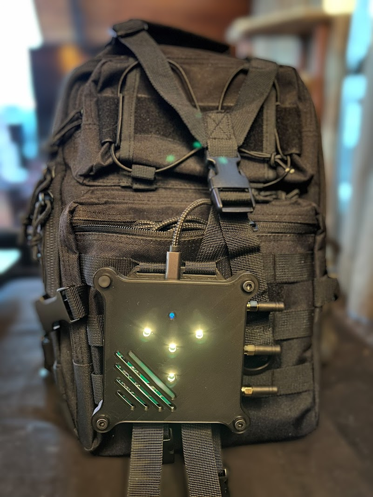

# Hak5 Wi-Fi Pineapple MK7 Tactical Case

A *completely unofficial* case for the MK7 with mounting for straps.

## Parts list

In addition to printing the [./mk7-tactical-v2-case-top.stl](top) and [./mk7-tactical-v2-case-bottom.stl](bottom) parts of the case, you will need:

1. 4x M5x8mm bolts

    These are used to hold the top and bottom of the case together.  Black oxide is usually a nice finish.

2. 4x M5 nuts

    These are used to hold the top and bottom of the case together, and are hidden inside the countersinks.  Finish doesn't matter much.

3. 4x M3x6mm bolts

    These are used to hold the MK7 PCB inside the case.  Finish doesn't matter.

4. 4x M3 nuts

    These are used to hold the MK7 PCB and fit inside the countersinks on the bottom of the case.

## Printing

Generally for strength and durability I recommend printing the case in PETG, however PLA is likely just fine for most situations.

For strength, the prints should be done with extra perimeters; 4 to 8 perimeters in the slicer should yield a very strong print.

The V2 case is designed to be printable without supports.

## Tactical + Kismet Acrylcis

Have an acrylic Kismet MK7 case?  Want to get in on the tacti-cool mounting?  Grab the [./mk7-kismetcase-tactical-bottom.stl](Kismet mod bottom STL); it replaces the existing blank acrylic bottom piece and uses the same screws.

