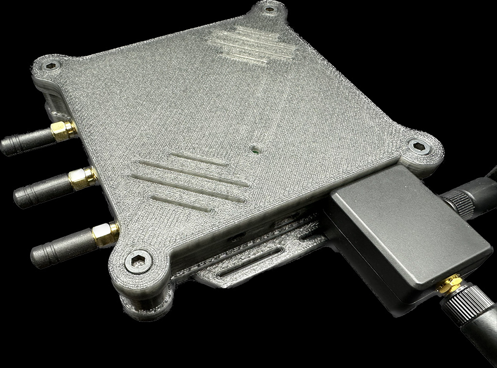
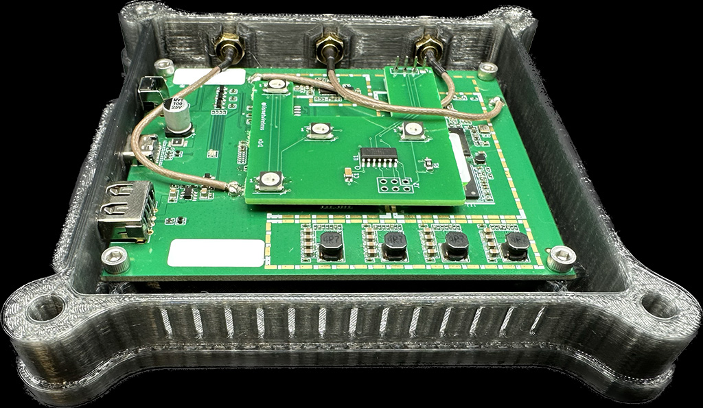

# Hak5 Wi-Fi Pineapple MK7 Tactical Case (v3)

A *completely unofficial* case for the MK7 with mounting for straps.

## Changes in V3

* Fits the MK7AC USB module cleanly

* Better printability with built-in bridges on the countersunk holes

* Better antenna mounting with solid internal antenna captures

* Better modeling of the USB and power ports

* Sunken bolts on the top panel for a flush surface

## Parts list

In addition to printing the [top](./mk7-tactical-v3-top.stl) and [bottom](./mk7-tactical-v3-bottom.stl) parts of the case, you will need:

1. 4x M5x8mm bolts

    These are used to hold the top and bottom of the case together.  Black oxide is usually a nice finish.

2. 4x M5 nuts

    These are used to hold the top and bottom of the case together, and are hidden inside the countersinks.  Finish doesn't matter much.

3. 4x M3x6mm bolts

    These are used to hold the MK7 PCB inside the case.  Finish doesn't matter.

4. 4x M3 nuts

    These are used to hold the MK7 PCB and fit inside the countersinks on the bottom of the case.

## Printing

Generally for strength and durability I recommend printing the case in PETG, however PLA is likely just fine for most situations.

For strength, the prints should be done with extra perimeters; 4 to 8 perimeters in the slicer should yield a very strong print.

The V3 case is designed to be printable without supports.

